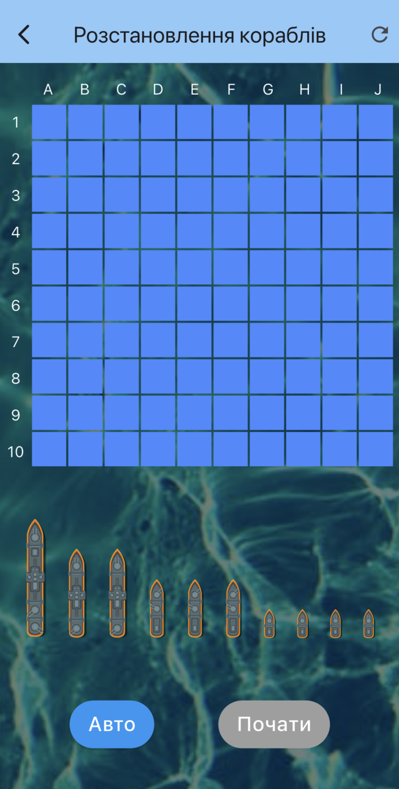

# Морський бій

"Морський бій" — це мобільна гра на Flutter, що відтворює класичну гру в морський бій.  

## 🚀 Функціонал
- Ручне або автоматичне розташування кораблів
- Початок гри після розташування всіх кораблів
- Зручний інтерфейс із підтримкою drag-and-drop  

## 🛠️ Технології
- **Flutter**: для UI та логіки
- **Riverpod**: для управління станом
- **Dart**: основна мова програмування  

## 📸 Скріншоти

### Головний екран


### Розташування кораблів



## 📖 Як запустити проект
1. Склонуй репозиторій:
   ```bash
   git clone https://github.com/Towikk01/test_warships.git
   cd test_warships

2. Встанови залежності:
    flutter pub get

3. Запусти проект:
    flutter run


